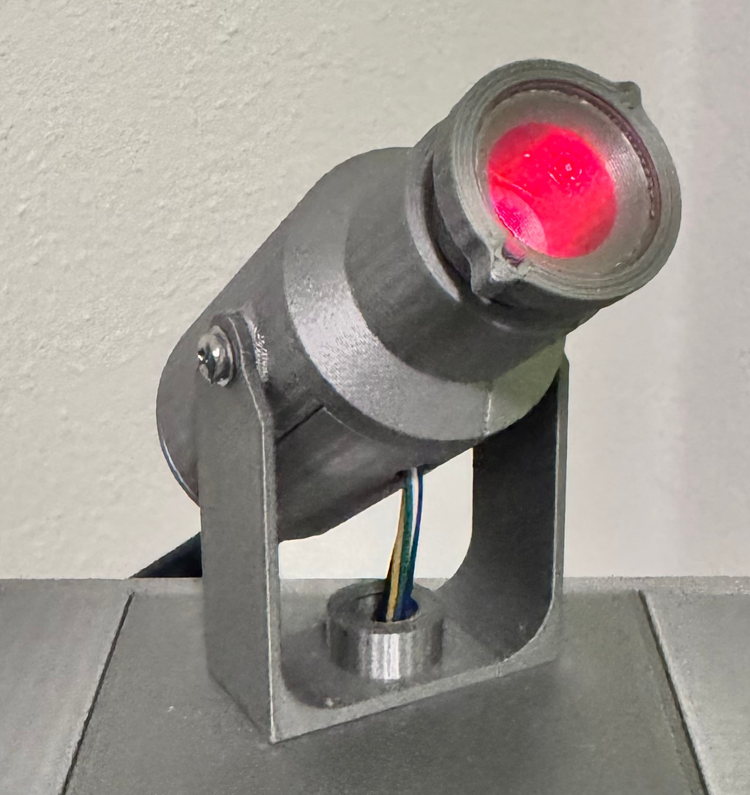
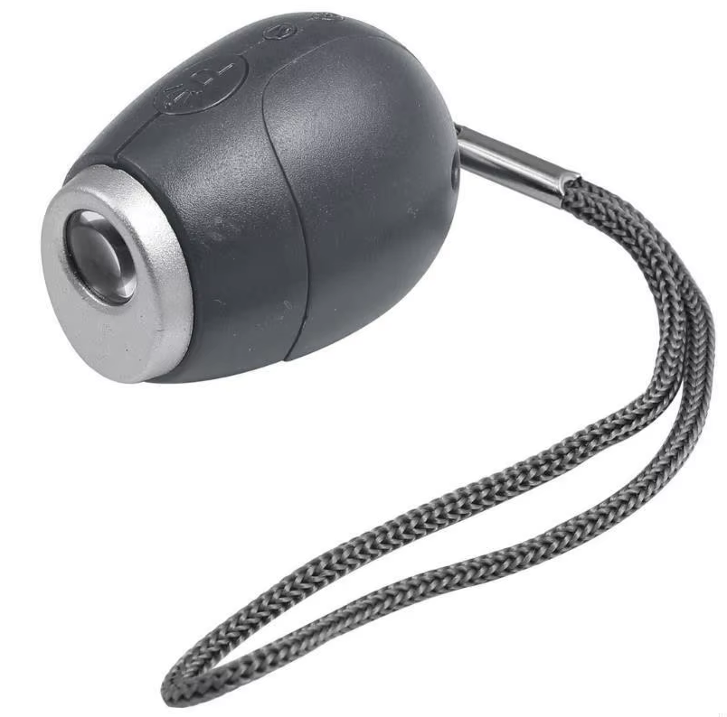
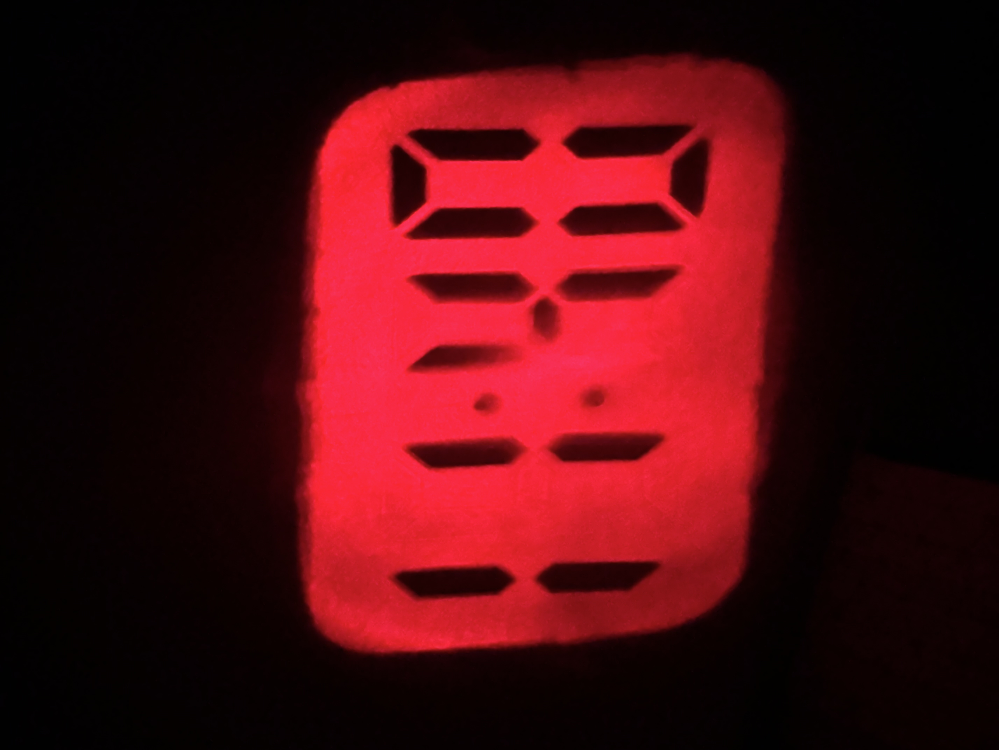

# Arduino-Clock-Projector  
A simple little projector module for your DIY alarm clock 🕒✨

Building an alarm clock **with a real wall projector** is surprisingly hard.  
Until now there wasn’t really an easy way to just *buy a small module* that can project the time cleanly.

So I went looking and found this **cheap LED projector lamp on AliExpress**:  
https://de.aliexpress.com/item/1005009155662454.html  

It’s super affordable, but it also has a few downsides:

- It’s a **7-segment display**
- You only get **3 full digits**
- The first digit is basically a “1” made from only **two segments**
- Plus the **":"** in the middle

That said — the important part is:  
✅ We only need the **LCD**, the **rubber contact piece**, and the **lens** from the projector.

---

## Pictures

Here are a few pictures from the project:

  
  

---

## What’s in this project?

I designed a custom PCB using the **HT1621 LCD driver**, and the rest of the build is done with **3D printed parts**.  
All required files are included in this repository.

For a nicer final look, you can also add a small glass plate (20×1.5mm) from AliExpress:  
https://de.aliexpress.com/item/1005003692263992.html  

---

## Testing it

I also included a small **Arduino test sketch** so you can try it immediately.

**Basic setup:**
- Connect the module to your Arduino
- Add a small resistor for the LED
- Power it up and enjoy the magic 😄

If the image isn’t sharp, just **twist the lens holder** until the projection is in focus.

From my experience, the LED works best in darker rooms and projects clearly for about **3–4 meters**.

---

## LED recommendation (important!)

It’s **really important** to use an LED with a **15° viewing angle**, otherwise the projection will look weak or blurry.

These LEDs work great (I used them myself):

**Green:**  
https://www.reichelt.de/de/de/shop/produkt/led_5_mm_bedrahtet_gruen_43300_mcd_15_-230982  

**Classic Red:**  
https://www.reichelt.de/de/de/shop/produkt/led_5mm_bedrahtet_rot_20000_mcd_15_-361605?nbc=1  

---

Have fun testing and tinkering! 😄🔧
